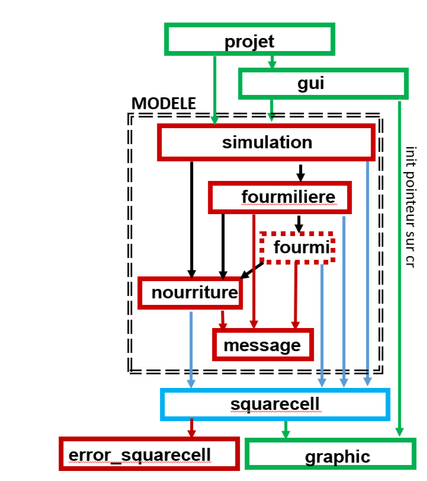

this project is a 2D grid simulation where "ants" fight for resosurces

Projet : Main file, process command line argument, call the gui and the simulation
gui : display a windows, link the button with the simulation fonction,
graphics : display the physical grid read from squarecell
simulation : iterrate over every fourmiliere for refresh, generate food, read and write simulation to file
fourmillièere : fonction relative to fourmiliere, update les fourmis qui lui sont propre keep track of food and such
fourmi : classe hérité de fourmi pour chaque type de fourmis, methode update pour les faire bouger, pathplanning for food, etc
nourriture : fonction pour update la bouffe sur le plateau
squarecell : methode générique pour les test de collission et distance
message : message to display
error:squarecell : error to display

squarecell instance is passed as an argument to every entity and subsequently returned updated
