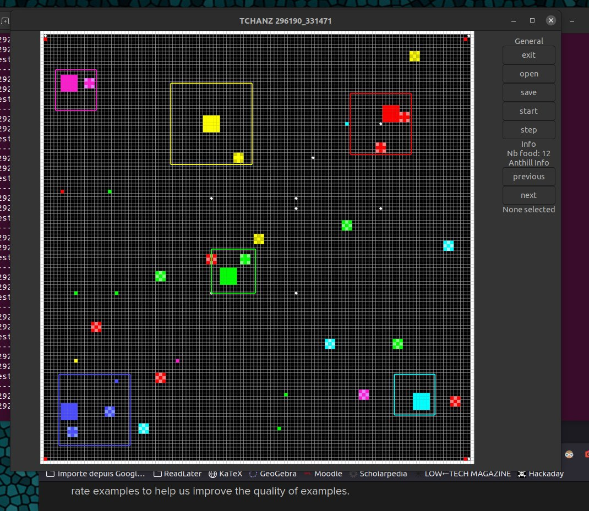

this project is a 2D grid simulation where "ants" fight for resources
## présentation



(it works on windows 11 with WSL or linux with GTKmm installed)

## install 
```sudo apt install libgtkmm-3.0-dev libgstreamermm-1.0-dev```
```git clone https://github.com/nathmo/TCHANZ```
```cd TCHANZ```
```make ```
```./projet scenario/t18.txt```

## fichier

Projet : Main file, process command line argument, call the gui and the simulation

gui : display a windows, link the button with the simulation fonction,

graphics : display the physical grid read from squarecell

simulation : iterrate over every fourmiliere for refresh, generate food, read and write simulation to file

fourmillièere : fonction relative to fourmiliere, update les fourmis qui lui sont propre keep track of food and such

fourmi : classe hérité de fourmi pour chaque type de fourmis, methode update pour les faire bouger, pathplanning for food, etc

nourriture : fonction pour update la bouffe sur le plateau

squarecell : methode générique pour les test de collission et distance

message : message to display

error_squarecell : error to display

entity : generic class that all entity inherit from to share some common interface

textstorage : function to export the simulation state to a file and import it back

GTKmm : graphic library for the GUI

constante : global constante to projet

## organisation des classes du modèles

La hiérarchie de classe du modèles et des fourmis est organisé comme suis :
un module entity fut créer pour profité pleinement du méchanisme de polymophisme. fourmillière, fourmi et nourriture en hérite car il possèdent tous une forme et une position ainsi que le besoin d'être affiché à l'écrans et dêtre update à chaque tick de la simulation. Entity fournit donc des méthode virtuel que chaque entité redéfinis pour être déssiné ainsi qu'updater et exporter ses parametres. une série de fonction normal fournisse un acces au proriété commune tel que la position ou la taille ou le flag qui indique si l'entity doit etre détruite.

Fourmi possède une classe fourmi générique dans lesquelles sont regroupé les propriété commune a toutes les foumis tel que l'age ou un buffer contenant les prochain pas à effectué. (la plus pars des fonction plus intéressante étant déja dans entity, il n'y as pas cas de les redéfinir ici)

```
                                                   ┌────────┐
                                                   │        │
                                                   │ projet │
                                                   │        │
                                                   └───┬────┘
                                                       │
                                                       │
                                                   ┌───┴───────────────┐
                                                   ▼                   ▼
                          ┌─────────────┐    ┌────────────┐         ┌─────┐
                          │             │    │            │         │     │
                          │ textstorage │◄───┤ simulation │◄────────┤ gui │
                          │             │    │            │         │     │
                          └─────┬───────┘    └─────┬─────┬┘         └──┬──┘
                                │                  │     │             │
                                └─────────┬────────┘     │             │
                                          │              │             │
   ┌────────────┬───────────────┬─────────┴─────┐        │             │
   │            │               │               │        │             │
   │            │               │               │        │             │
   │            ▼               ▼               ▼        │             │
   │     ┌──────────────┐     ┌────────┐  ┌────────────┐ │             │
   │     │              │     │        │  │            │ │             │
   │     │ fourmilliere ├────►│ fourmi │  │ nourriture │ │             │
   │     │              │     │        │  │            │ │             │
   │     └─────┬────────┘     └─┬──────┘  └──────┬─────┘ │             │
   │           │                │                │       │             │
   │           └────────────────┼────────────────┘       │             │
   │                            │                        │             ├────────┐
   │ ┌───────────────┬──────────┴──────┬───────────┐     │             │        │
   │ │               │                 │           │     │             │        │
   ▼ ▼               ▼                 │           ▼     ▼             ▼        │
┌─────────┐     ┌────────────┐         │          ┌─────────┐     ┌─────────┐   │
│         │     │            │         │          │         │     │         │   │
│ entity  │     │ squarecell │         │          │ message │  ┌─►│ graphic │   │
│         │     │            │ ────┐   │          │         │  │  │         │   │
└─────────┘     └────┬───┬───┘     │   │          └─────────┘  │  └─┬──────┬┘   │
                     │   │         │   │                       │    │      │    │
                     │   │         └───┼───────────────────────┘    │      │    │
                     │   │             │                            │      │    │
                     │   └───────┐     │  ┌─────────────────────────┘      ▼    ▼
                     ▼           ▼     ▼  ▼                                ┌───────┐
          ┌──────────────────┐  ┌───────────┐                              │       │
          │                  │  │           │                              │ GTKmm │
          │ error_squarecell │  │ constante │                              │       │
          │                  │  │           │                              └───────┘
          └──────────────────┘  └───────────┘
```

## structuration des données des entités du modèles
Voici la liste des attributs et fonction principale disponible dans chaques classes
- Fourmilliere Contient le nombre de chaqu'une de ses fourmis ainsi qu'un vecteur de pointeur vers ses fourmis membre en plus des accesseurs a ceux-ci et des méthodes virtual hérité (la méthode update vas appeler update sur chaque fourmis membre) de entity et de la méthode qui permet d'importer une fourmillièere a partir de ces paramètre. De plus elle contients des méthode pour générer de nouvelles fourmis au hazard et l'expensions de la fourmillière.
- Nourriture ne contient aucune propriété supplémentaire et ce contente simplement de refédinir les fonction de dessin et d'export dont elle hérite ainsi qu'une fonction pour creer une instance de nourriture depuis un fichier externe.
- Entity contient un champ squarcell qui represente la surface occupé par l'entité. de plus entity stock un booléan endOfLife qui indique si une instance doit etre détruite et un id qui permet de représenter l'appartenance a un groupe ou l'ordre d'apparition dans le fichier. entity stoque aussi le RNG en static et specie qui encode l'espece de l'entity (utile pour caster une entity vers sont type plus spécifique)
- Simulation contient un vecteur de pointeur vers les nourriturre présente sur le plateau ainsi que les fourmillières ainsi que d'une interface pour faire simmuler un tick au modele et de retourne des statistique sur celui-ci (nombre de fourmilliere, nourriture, etc) ainsi qu'une méthode pour importer une simulation depuis et un fichier et exporter la simulation courante vers un fichier.

le choix de déléguer l'importation et l'exportation a une module spécifique à été fait pour rendre l'exportation plus générique (si on décide d'exporter dans un type de fichier ou dans le cloud par exemple)

### représentation des entitées dans simulation

Comme indiqué précédement simulation contient un vecteur de pointeur vers la nourriture et les fourmillières
les fourmillières contienne un vecteur de pointeurs vers leurs fourmis respective. fourmillière fournit une fonction qui retourne la liste de ses fourmis pour que l'intégralité des entité du modèles puisse être passé en argument a la méthode update de chaque entity qui pourra prendre des décisions informé sur ces prochaines actions.

### Brève description des types mis en œuvre dans squarecell :

Squarcell contient un point qui indique la position d'une entité ainsi qu'un flag booléen qui précision si la position est au centre ou dans le coin inférieur gauche. de plus squarcell contient la largeur et la hauteur de chaque entité et la position de sont coin inférieur gauche et supérieur droit (ce qui permet de s'affranchir de la problématique de l'ogine centré ou non)
squarecell contient aussi un char qui représente le calque sur lequelle un carré se trouve pour rendre plus flexible les calculs de collisions.
finalement squarcell contient un vecteur de char static qui représente la grille pour vérifier a moindre cout si une région donné est libre ou non.