# Documentation final de TCHANZ
## Approche pour les déplacements
### Lieu de naissance des fourmis :
Le lieu de naissance des fourmis est choisi au hazard pour garantir une homogénéité entre chaque famille de case et donc maximiser le nombre de nourriture qui peuvent être atteintes dans le cas des collectors et d'assurer une certaine égalité d'apparition des autres type de fourmis dans la fourmilliere.

### Generator :
La fourmi Generator essaie de se placer au centre de la fourmilière. 
Sauf dans le cas où une largeur de 3 carrés ne peut-être garantie 
entre la Generator et le bord de la fourmilière où les fourmis peuvent 
apparaitre. Ceci dans le but de permettre la génération de fourmis, 
même avec la plus petite fourmilière possible.

### Collector :
Dans le cas où deux chemins sont égaux (dans leur changement de direction),
la Collector calcule le nombre de superposition à chaque pas et choisis
le chemin qui cumule le moins de superposition avec d'autres entités.
Une fourmi collector sans nourriture cible se contente de se déplacer
au hazard sur le plateau dans le but de maximiser ses chances qu'elle
soit au plus proche d'une nourriture lors de son apparition.

### Defensor :
Les Defensors calculent la bordure la plus proche et s'y rendent. Une fois sur la bordure, elles se contentent de se déplacer d'un côté et de l'autre pour ne pas bloquer une Collector ou une Predator qui sortiraient de la fourmilière.

### Predator :
La fourmi Predator tente simplement de retourner dans sa fourmilière et s'y balade au hazard. Les déplacements au hazard étant là pour éviter les blocages avec d'autres fourmis de la fourmilière.

## Screenshot
Fichier f06.txt. Mise à jour chaque 2 step. 

step 0 and step 2

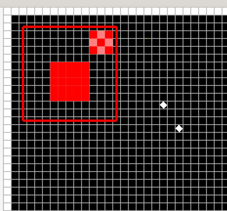
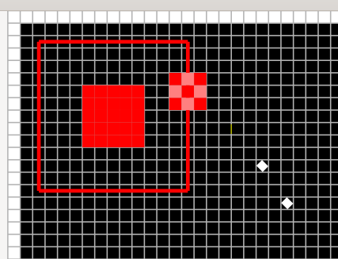

step 4 and step 6

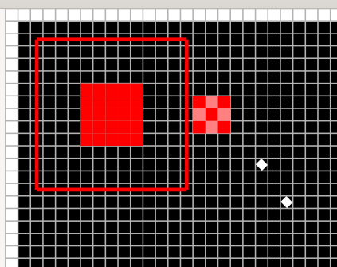
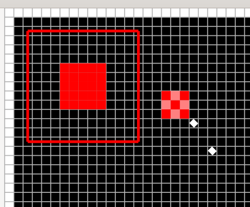

step 8 and step 10

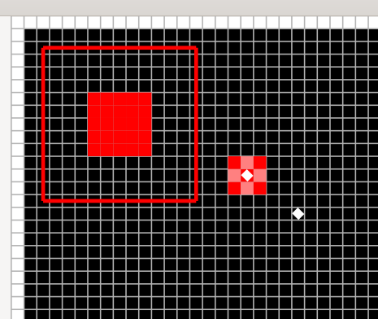

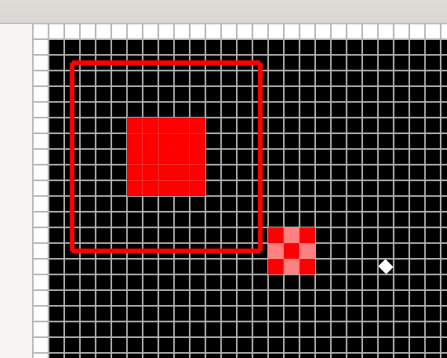

Fichier test crée par nous. Mise à jour chaque 4 step sauf dernière photo (10 step).
step 0 and 4

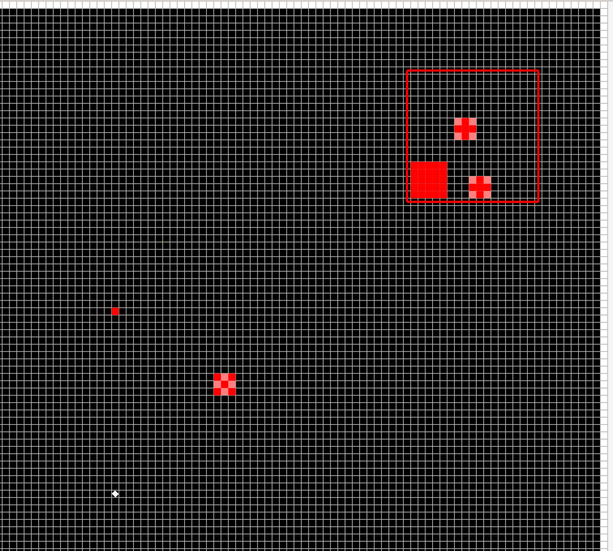
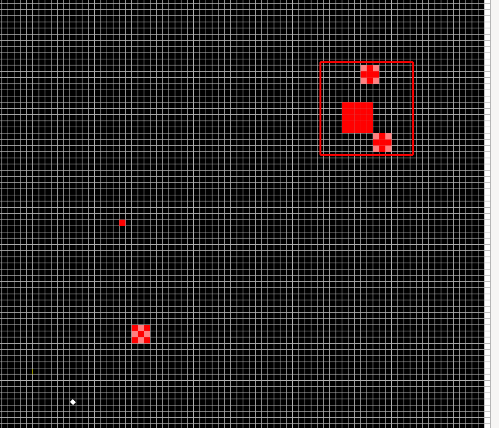

step 8 and 12

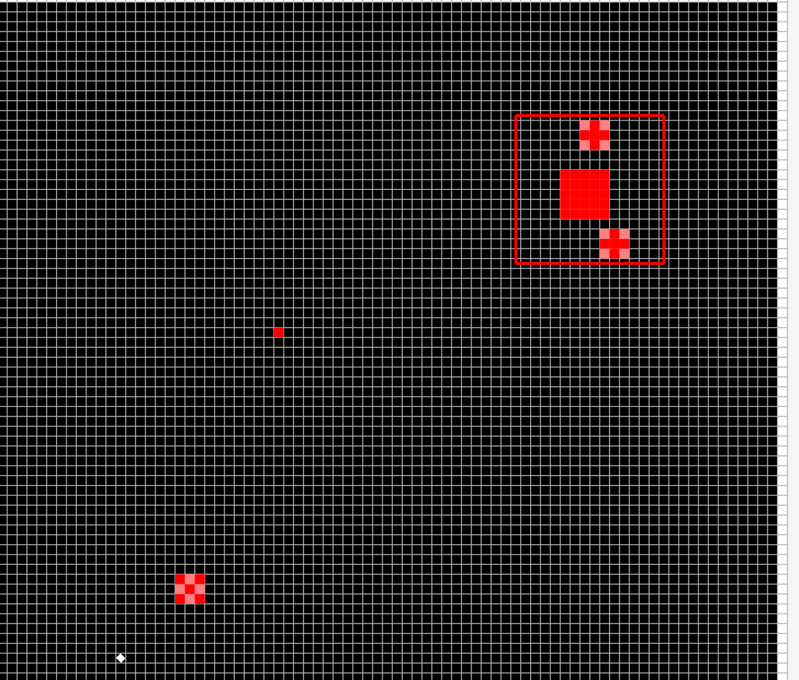
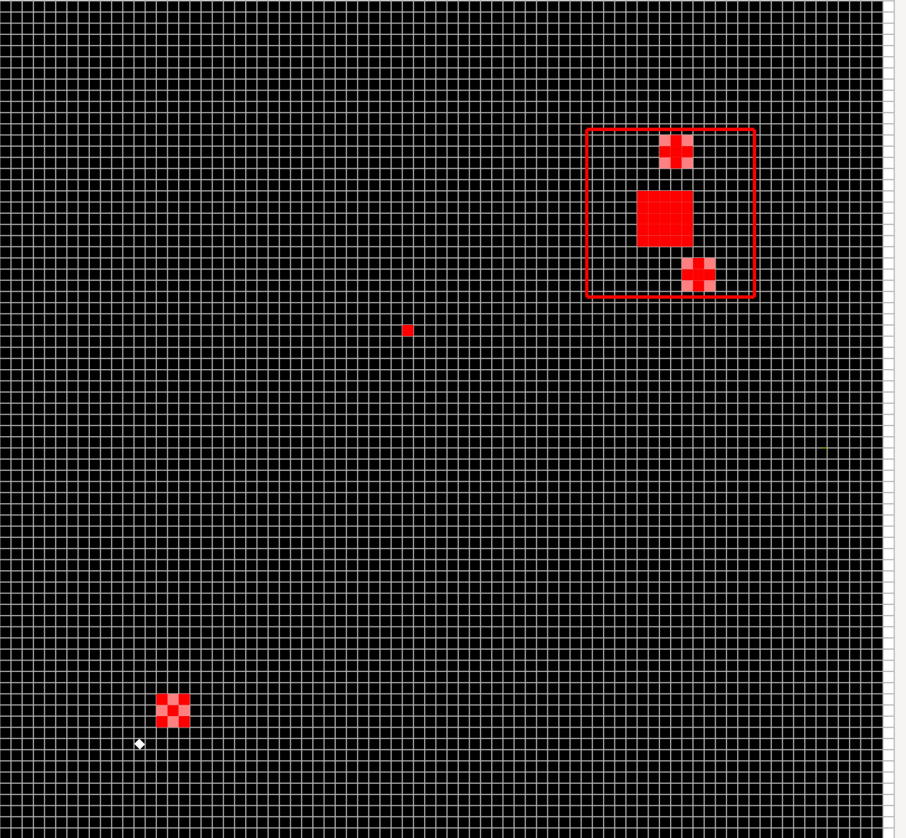

step 16 and 20

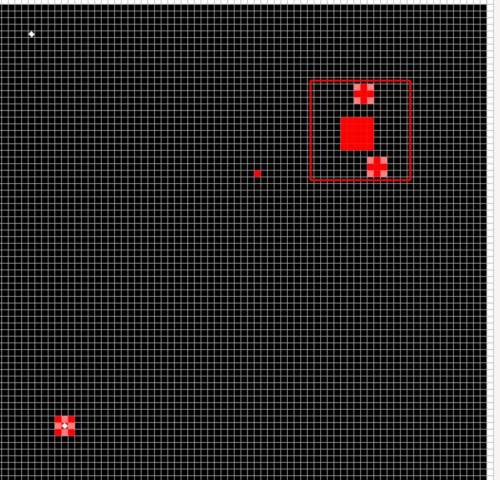
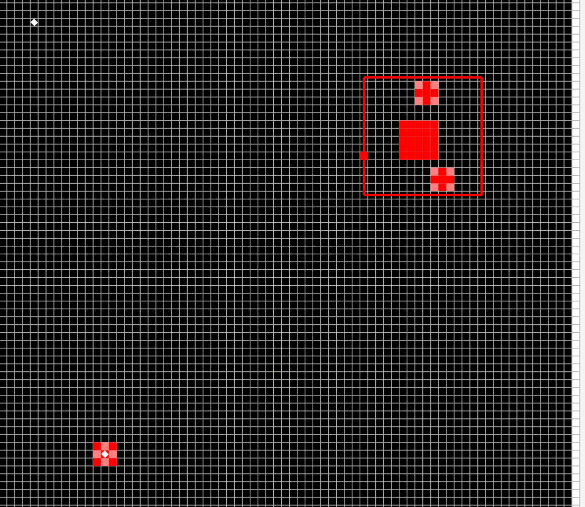

step 30

## Méthodologie :
Nous avons mis en place un Git depuis le début. Nous étions ainsi capable de programmer ensemble (en général le vendredi en séance d'exercices) et seul quand nous avions du temps libre. Nous travaillons généralement ensemble pour résoudre les bugs les plus coriaces et seul le reste du temps avec des meetings régulier pour tenir l'autre à jour sur l'avance du quand sur l'avancement global, les prochaines étapes et le fonctionnement du code déjà écris. Nous nous sommes répartis les fonctions et modules en fonction des affinités. L'un de nous ayant plus d'affinité avec la structure du code et l'autre avec l'implémentation d'algorithme.
[Nathann] s'est chargé du module simulation ainsi que des machines d'état de chaque fourmis et de la génération et la mort des entity en faisant appelles aux fonctions que [Felipe] se chargeait de faire pendant ce temps-là. [Felipe] à fait les algorithmes pour permettre aux fourmis de trouver les nourritures, leurs maisons, les autres fourmis à attaquer ou encore la bordure la plus proche ainsi que le "pathfinding" ou encore le calcul de distance. Nous avons finalisé le "pathfinding" ensemble suite à quelques complications algorithmique.

Nous avions mis en place une série de tests automatique que git lançait à chaque push pour s'assurer que les modifications ne cassaient pas le travail antérieur pour le rendu 1.
les tests d'intégration automatique de la simulation étant plus compliqué à mettre en place avec une interface graphique, nous nous sommes contenté de faire des tests unitaires manuels sur les fonctions au fur et à mesure et de souvent tester l'exécution du programme dans son ensemble.

Les bugs les plus courants étaient l'oubli de vérifier si un pointeur contenait autre chose que nullptr ce qui résultait en segmentation fault. Mais les plus compliquées a dé-bugger étaient les fautes d'algorithmique qui se cachait généralement de manière cryptique.

## Conclusion :

Le projet est intéressant dans son ensemble. Le fait que certains détails d'implémentation soit imposé n'était pas toujours agréable, mais la documentation et le discourse évitaient que cela crée trop de problème. Nous nous sommes bien amusé même si le projet est relativement chronophage. Il nous semble que nous avons fait du bon travail dans l'ensemble et utilisé judicieusement les outils de développement tel que git, WSL (qui supporte le GUI sur windows 11) et les pipelines de test. Il est dommage que le projet utilise GTKmm et pas quelque chose comme QT qui est un peu plus moderne, mais cela fut très enrichissant.
